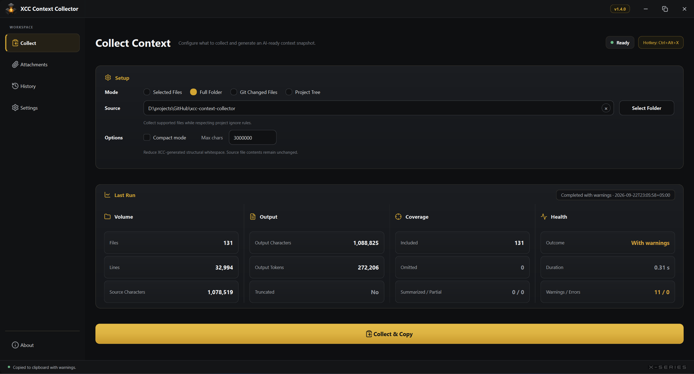
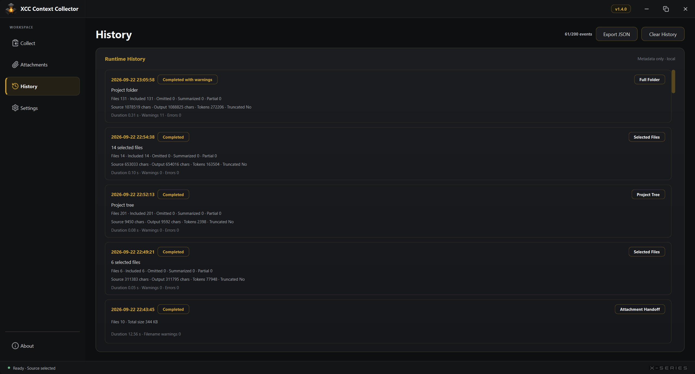

[](https://github.com/End1essspace/xcc-context-collector/actions/workflows/ci.yml)
[](https://github.com/End1essspace/xcc-context-collector/releases)
[](LICENSE)

# XCC Context Collector

**English** · [Русский](#русский)

XCC Context Collector is a Windows desktop utility that turns project files, folders, Git changes, or a project tree into one structured context block for AI coding assistants.

It is built for developers working with ChatGPT, Codex, Claude, and similar tools when sending many project files manually is slow, repetitive, or blocked by attachment and context-size limits.

Current version: **v1.2.0**

[Download from GitHub Releases](https://github.com/End1essspace/xcc-context-collector/releases)

## Interface

| Collect and result health | Metadata-only runtime history |
|---|---|
|  |  |

Official builds are published through GitHub Releases after the automated and clean-host Windows validation gates described in [`docs/M10_VALIDATION.md`](docs/M10_VALIDATION.md).

## What XCC does

XCC provides four collection modes:

| Mode | Purpose |
|---|---|
| **Selected Files** | Collect explicitly selected files, including files from different folders or drives. |
| **Full Folder** | Scan a project folder, apply built-in exclusions and project ignore rules, and include a project tree. |
| **Git Changed Files** | Collect supported changed files plus separately labelled staged and unstaged Git diffs. |
| **Project Tree** | Produce structure-only context without file contents. |

The generated output can include:

- XCC version, mode, and collection statistics;
- safety-warning summaries;
- typed Git status and staged/unstaged diffs;
- a project tree;
- complete per-file sections;
- errors and an explicit budget summary when output is truncated.

## v1.2.0 highlights

### Source-content fidelity

Collected file payloads are framed without trimming, compacting, normalizing, or rewriting their contents. Compact mode affects only XCC-generated structural text.

### Complete Git context

Git mode uses null-delimited porcelain status data and a typed change model. It handles staged, unstaged, untracked, renamed, copied, and deleted changes, including paths with spaces and Unicode.

### Stable file identity

Selected files receive stable, distinguishable display paths. Duplicate basenames and cross-root selections no longer collapse into ambiguous filename-only headers.

### Structure-aware character budget

XCC adds complete structural sections while space remains and reports what was included, omitted, summarized, or partially represented. Source files and Git diffs are not silently cut in the middle.

### Context safety visibility

XCC detects likely sensitive filenames, private-key headers, API tokens, credentials, and credential-bearing connection strings. Detection is heuristic and warning-only: source code is not silently redacted or modified.

The **Safety confirmation** setting controls only the modal pre-copy prompt. Disabling it does not disable detection, warning summaries, counters, outcomes, or metadata-only history.

### Responsive collection pipeline

Scanning, Git inspection, file reading, safety analysis, formatting, and budget processing run outside the Qt main thread. The GUI stays interactive, only one job can run, and cooperative cancellation never copies a partial result.

### Result health and runtime history

Every run has one outcome:

```text
SUCCESS
SUCCESS_WITH_WARNINGS
CANCELLED
FAILED
```

Last Run and Runtime History show duration, coverage, truncation, warnings, and errors. History is in-memory and stores metadata only; it does not store collected file contents, Git diffs, detected values, or failure-message bodies.

## Windows integration

- PySide6 desktop interface
- System-tray mode
- `Ctrl+Alt+X` native restore hotkey
- `Esc` to hide the window to tray
- Close-to-tray behavior
- Single-instance protection
- Optional Start with Windows shortcut
- Persistent local settings
- Packaged application and tray artwork

## Supported files

XCC collects supported text files by extension and selected project files by exact filename.

### Extensions

```text
Python:                 .py .pyw
JavaScript / frontend:  .js .jsx .ts .tsx .mjs .cjs .html .css
                        .scss .sass .less .vue .svelte
Backend / system:       .java .kt .kts .cs .go .rs .c .h .cpp
                        .hpp .cc .cxx .php .rb .swift
Data / API / database:  .sql .graphql .gql
Documentation:          .md .mdx .rst .txt
Configuration:          .json .jsonc .yaml .yml .toml .ini .cfg
                        .conf .properties .xml
Scripts:                .sh .bash .zsh .ps1 .bat .cmd
```

### Exact filenames

```text
Dockerfile
Containerfile
Makefile
CMakeLists.txt
requirements.txt
pyproject.toml
setup.py
setup.cfg
package.json
tsconfig.json
vite.config.js
vite.config.ts
next.config.js
next.config.ts
.gitignore
.xccignore
.dockerignore
.gitattributes
.editorconfig
.env.example
.env.template
.env.sample
```

Files such as real `.env` files, private keys, certificates, databases, logs, archives, and binaries are not included by default.

## Built-in excluded folders

```text
.git
.idea
.vscode
.venv
venv
__pycache__
.pytest_cache
.mypy_cache
.ruff_cache
node_modules
dist
build
bin
obj
```

Built-in exclusions cannot be re-enabled by project ignore rules.

## `.xccignore` and `.gitignore`

Create `.xccignore` in the project root to add XCC-specific exclusions:

```text
# comments and empty lines are ignored
*.generated.py       # name pattern at any depth
private/**           # recursive path pattern
/cache/              # root-anchored directory
!private/example.py  # re-include a matching project path
```

Supported semantics include `*`, `?`, `**`, trailing `/`, root-leading `/`, and `!` negation. The last matching project rule wins.

Mode behavior:

- **Full Folder** and **Project Tree** respect root `.gitignore` and `.xccignore` by default.
- **Git Changed Files** relies on Git status for normal Git ignore behavior and applies `.xccignore` as an additional XCC-only layer.
- **Selected Files** treats explicit user selection as intentional and does not apply project ignore rules.

## Character budget behavior

The configured **Max output chars** value is a hard upper bound for generated context.

When the full result does not fit, XCC emits an `# XCC Budget Summary` describing:

- limit and used characters;
- included and omitted files;
- summarized and partial files;
- Git diff, project tree, error, and safety-warning section status;
- a bounded list of omitted paths.

Partial source-file inclusion is disabled by default in v1.2.0, so `Partial files` remains `0` for normal collection output.

## Local data and privacy

Settings are stored locally at:

```text
%USERPROFILE%\.xcc\config.json
```

XCC has no cloud account requirement and does not upload collected context. The final generated block is copied to the Windows clipboard only after collection completes and any enabled safety confirmation is accepted.

## Portable package

The official Windows x64 package is a portable ZIP:

```text
XCC-Context-Collector-v1.2.0-win64.zip
XCC-Context-Collector-v1.2.0-win64.zip.sha256
```

Extract the complete `XCC Context Collector` directory and run:

```text
XCC Context Collector.exe
```

Keep `_internal` and `VERSION.txt` beside the executable. Python is not required for the packaged build.

See [`docs/PORTABLE_ZIP.md`](docs/PORTABLE_ZIP.md) for checksum verification, upgrades, removal, and troubleshooting.

## Run from source

XCC v1.2.0 supports **CPython 3.13.x** on Windows 10/11 x64.

```powershell
py -3.13 -m venv .venv
.\.venv\Scripts\Activate.ps1
python -m pip install --upgrade pip
python -m pip install -e ".[dev]"
python -m compileall -q src tests scripts gui.py run.py hotkey.py
python scripts\check_version_consistency.py
python -m pytest -q
python gui.py
```

The installed GUI entry point is also available after installation:

```powershell
xcc-context-collector
```

## Build and validate the Windows package

```powershell
python -m pip install -e ".[dev,build]"
powershell -ExecutionPolicy Bypass -File scripts\validate_release_candidate.ps1
```

The release-candidate gate performs compilation, version checks, the full test suite, clean-install validation, PyInstaller packaging, packaged startup smoke, portable ZIP creation, checksum generation, and archive validation.

Manual Windows 10/11 validation and evidence recording are documented in [`docs/M10_VALIDATION.md`](docs/M10_VALIDATION.md).

## Legacy development tools

The supported product is the PySide6 GUI. These root entry points remain only for unsupported development compatibility:

```powershell
python run.py
python -m pip install -e ".[legacy]"
python hotkey.py
```

New product features must target `gui.py -> xcc.gui -> xcc.pipeline` and the native Windows hotkey path.

## Documentation

- [Architecture](docs/ARCHITECTURE.md)
- [Bug-report diagnostics](docs/BUG_REPORTING.md)
- [Portable ZIP usage](docs/PORTABLE_ZIP.md)
- [v1.2.0 validation procedure](docs/M10_VALIDATION.md)
- [Release checklist](docs/RELEASE_CHECKLIST.md)
- [Roadmap](docs/roadmap.md)
- [v1.2.0 release notes](docs/releases/v1.2.0.md)
- [Contributing](CONTRIBUTING.md)
- [Security policy](SECURITY.md)

## System requirements

- Windows 10 or Windows 11, 64-bit
- CPython 3.13.x only for supported source/development mode
- No Python installation required for the packaged application

## Author

**XCON | RX**  
Telegram: [@End1essspace](https://t.me/End1essspace)  
GitHub: [End1essspace](https://github.com/End1essspace)

## License

XCC Context Collector is licensed under the [GNU General Public License v3.0](LICENSE).

Copyright (C) 2026 Rafael Xudoynazarov (XCON | RX)

---

# Русский

**XCC Context Collector** — Windows-приложение, которое собирает выбранные файлы, папку проекта, Git-изменения или только дерево проекта в один структурированный блок контекста для AI-ассистентов.

XCC рассчитан на разработчиков, работающих с ChatGPT, Codex, Claude и аналогичными инструментами, когда ручная отправка множества файлов занимает время или упирается в ограничения на вложения и размер контекста.

Текущая версия: **v1.2.0**

[Скачать на GitHub Releases](https://github.com/End1essspace/xcc-context-collector/releases)

## Интерфейс

| Сбор и состояние результата | История запусков без содержимого файлов |
|---|---|
|  |  |

Официальные сборки публикуются через GitHub Releases после автоматической проверки и ручной валидации на чистых Windows-хостах по процедуре из [`docs/M10_VALIDATION.md`](docs/M10_VALIDATION.md).

## Режимы сбора

| Режим | Назначение |
|---|---|
| **Selected Files** | Сбор явно выбранных файлов, в том числе из разных папок и дисков. |
| **Full Folder** | Сканирование папки проекта с учётом встроенных исключений и project ignore rules. |
| **Git Changed Files** | Сбор поддерживаемых изменённых файлов и раздельных staged/unstaged Git diff. |
| **Project Tree** | Контекст только по структуре проекта, без содержимого файлов. |

Готовый output может содержать:

- версию XCC, режим и статистику;
- краткий список safety warnings;
- typed Git status и раздельные staged/unstaged diff;
- дерево проекта;
- полные секции файлов;
- ошибки и явный budget summary при ограничении output.

## Главное в v1.2.0

### Точное сохранение исходного содержимого

XCC не обрезает, не уплотняет и не нормализует payload собранных файлов. Compact mode применяется только к структурному тексту, созданному самим XCC.

### Полный Git-контекст

Git mode использует null-delimited porcelain status и typed change model. Поддерживаются staged, unstaged, untracked, renamed, copied и deleted изменения, включая пути с пробелами и Unicode.

### Стабильная идентичность файлов

Выбранные файлы получают различимые относительные пути. Одинаковые basenames и выбор из разных корней больше не превращаются в неоднозначные filename-only заголовки.

### Structure-aware character budget

XCC добавляет только целые структурные секции и явно сообщает, какие файлы включены, пропущены или заменены summary. Исходные файлы и Git diff не обрываются молча посередине.

### Видимость чувствительного контекста

XCC эвристически обнаруживает чувствительные имена файлов, заголовки приватных ключей, вероятные API tokens, credentials и connection strings с credentials.

Настройка **Safety confirmation** управляет только модальным предупреждением перед копированием. При её отключении detection, warning summary, counters, outcomes и metadata-only history продолжают работать.

### Отзывчивый pipeline

Сканирование, Git inspection, чтение файлов, safety analysis, форматирование и budget processing выполняются вне Qt main thread. Одновременно может работать только одна задача, а cooperative cancellation не копирует частичный результат.

### Result health и runtime history

Каждый запуск получает один outcome:

```text
SUCCESS
SUCCESS_WITH_WARNINGS
CANCELLED
FAILED
```

Last Run и Runtime History показывают duration, coverage, truncation, warnings и errors. История хранится только в памяти и содержит metadata, но не содержимое файлов, Git diff, найденные значения или тексты failure messages.

## Интеграция с Windows

- PySide6 desktop interface
- System tray mode
- Нативный restore hotkey `Ctrl+Alt+X`
- `Esc` для скрытия окна в tray
- Close-to-tray
- Защита от второго экземпляра
- Опциональный Start with Windows
- Локальное сохранение настроек
- Корректные application и tray icons в packaged build

## Поддерживаемые файлы

### Расширения

```text
Python:                 .py .pyw
JavaScript / frontend:  .js .jsx .ts .tsx .mjs .cjs .html .css
                        .scss .sass .less .vue .svelte
Backend / system:       .java .kt .kts .cs .go .rs .c .h .cpp
                        .hpp .cc .cxx .php .rb .swift
Data / API / database:  .sql .graphql .gql
Документация:           .md .mdx .rst .txt
Конфигурация:           .json .jsonc .yaml .yml .toml .ini .cfg
                        .conf .properties .xml
Скрипты:                .sh .bash .zsh .ps1 .bat .cmd
```

### Точные имена файлов

```text
Dockerfile
Containerfile
Makefile
CMakeLists.txt
requirements.txt
pyproject.toml
setup.py
setup.cfg
package.json
tsconfig.json
vite.config.js
vite.config.ts
next.config.js
next.config.ts
.gitignore
.xccignore
.dockerignore
.gitattributes
.editorconfig
.env.example
.env.template
.env.sample
```

Настоящие `.env`, приватные ключи, сертификаты, базы данных, логи, архивы и бинарные файлы по умолчанию не включаются.

## Встроенные исключения

```text
.git
.idea
.vscode
.venv
venv
__pycache__
.pytest_cache
.mypy_cache
.ruff_cache
node_modules
dist
build
bin
obj
```

Встроенные исключения нельзя включить обратно через project ignore rules.

## `.xccignore` и `.gitignore`

Для дополнительных исключений создай `.xccignore` в корне проекта:

```text
# комментарии и пустые строки игнорируются
*.generated.py       # совпадение имени на любой глубине
private/**           # рекурсивный path pattern
/cache/              # директория относительно корня
!private/example.py  # повторное включение matching path
```

Поддерживаются `*`, `?`, `**`, завершающий `/`, начальный `/` и `!` negation. Побеждает последнее совпавшее project rule.

Поведение по режимам:

- **Full Folder** и **Project Tree** по умолчанию учитывают корневые `.gitignore` и `.xccignore`.
- **Git Changed Files** использует Git status для стандартного Git ignore behavior и применяет `.xccignore` как дополнительный XCC-only слой.
- **Selected Files** считает явный выбор пользователя намеренным и не применяет project ignore rules.

## Лимит символов

**Max output chars** является жёсткой верхней границей generated context.

Если весь результат не помещается, XCC добавляет `# XCC Budget Summary` с информацией о:

- лимите и фактически использованных символах;
- включённых и пропущенных файлах;
- summary и partial files;
- состоянии Git diff, project tree, errors и safety warnings;
- ограниченном списке пропущенных путей.

В v1.2.0 частичное включение исходных файлов по умолчанию отключено, поэтому в обычном output `Partial files` остаётся равным `0`.

## Локальные данные и приватность

Настройки хранятся локально:

```text
%USERPROFILE%\.xcc\config.json
```

XCC не требует облачного аккаунта и не загружает собранный context. Финальный блок попадает в Windows clipboard только после завершения collection и подтверждения safety dialog, если он включён.

## Portable ZIP

Официальный Windows x64 package распространяется как portable ZIP:

```text
XCC-Context-Collector-v1.2.0-win64.zip
XCC-Context-Collector-v1.2.0-win64.zip.sha256
```

Распакуй всю папку `XCC Context Collector` и запусти:

```text
XCC Context Collector.exe
```

Не отделяй executable от `_internal` и `VERSION.txt`. Для packaged build установка Python не нужна.

Подробности: [`docs/PORTABLE_ZIP.md`](docs/PORTABLE_ZIP.md).

## Запуск из исходников

XCC v1.2.0 поддерживает **CPython 3.13.x** на Windows 10/11 x64.

```powershell
py -3.13 -m venv .venv
.\.venv\Scripts\Activate.ps1
python -m pip install --upgrade pip
python -m pip install -e ".[dev]"
python -m compileall -q src tests scripts gui.py run.py hotkey.py
python scripts\check_version_consistency.py
python -m pytest -q
python gui.py
```

После установки также доступна команда:

```powershell
xcc-context-collector
```

## Сборка и release validation

```powershell
python -m pip install -e ".[dev,build]"
powershell -ExecutionPolicy Bypass -File scripts\validate_release_candidate.ps1
```

Release-candidate gate выполняет compileall, version consistency, полный test suite, clean-install validation, PyInstaller build, packaged startup smoke, создание portable ZIP, SHA-256 и archive validation.

Ручная Windows 10/11 validation и evidence recording описаны в [`docs/M10_VALIDATION.md`](docs/M10_VALIDATION.md).

## Legacy development tools

Поддерживаемый продукт — PySide6 GUI. Эти entry points сохранены только для неподдерживаемой development-совместимости:

```powershell
python run.py
python -m pip install -e ".[legacy]"
python hotkey.py
```

Новые product features должны развиваться через `gui.py -> xcc.gui -> xcc.pipeline` и native Windows hotkey path.

## Документация

- [Архитектура](docs/ARCHITECTURE.md)
- [Диагностика bug reports](docs/BUG_REPORTING.md)
- [Использование portable ZIP](docs/PORTABLE_ZIP.md)
- [Процедура validation v1.2.0](docs/M10_VALIDATION.md)
- [Release checklist](docs/RELEASE_CHECKLIST.md)
- [Roadmap](docs/roadmap.md)
- [Release notes v1.2.0](docs/releases/v1.2.0.md)
- [Contributing](CONTRIBUTING.md)
- [Security policy](SECURITY.md)

## Системные требования

- Windows 10 или Windows 11, 64-bit
- CPython 3.13.x только для поддерживаемого запуска из исходников
- Для packaged application Python не требуется

## Автор

**XCON | RX**  
Telegram: [@End1essspace](https://t.me/End1essspace)  
GitHub: [End1essspace](https://github.com/End1essspace)

## Лицензия

XCC Context Collector распространяется по лицензии [GNU General Public License v3.0](LICENSE).

Copyright (C) 2026 Rafael Xudoynazarov (XCON | RX)
