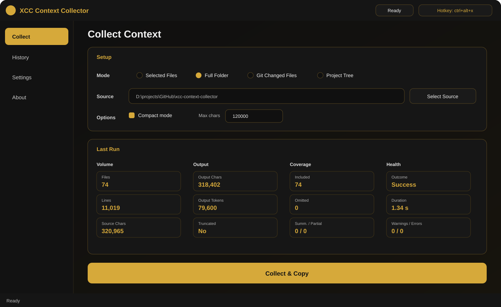
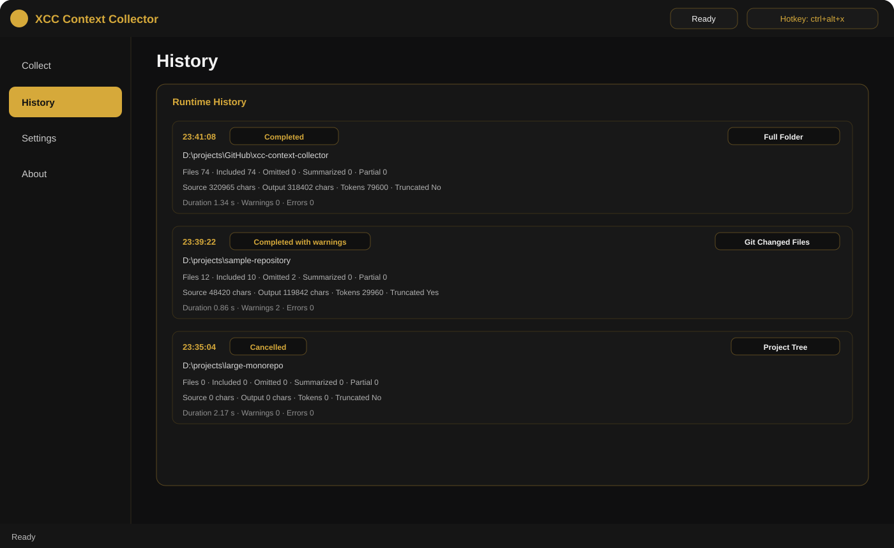

[](https://github.com/End1essspace/xcc-context-collector/actions/workflows/ci.yml)
[](https://github.com/End1essspace/xcc-context-collector/releases)
[](LICENSE)

[ENG]

📋 **XCC Context Collector**

**XCC Context Collector** is a Windows desktop utility for collecting clean project code context  
and copying it directly to the clipboard for AI coding workflows.

It is designed for developers working with **ChatGPT, Codex, Claude, and other AI assistants**,  
where structured project context needs to be prepared quickly and consistently.

AI chats often have limits on file uploads, attached files, and context size. Manually sending many project files is slow, repetitive, and often impossible in one message. XCC solves this by turning selected files, full project folders, Git changes, or a project tree into one structured AI-ready context block that can be pasted directly into an AI chat.

⬇️ **Download:** [GitHub Releases](https://github.com/End1essspace/xcc-context-collector/releases)

🖼 **Interface**

| Collect and result health | Metadata-only runtime history |
|---|---|
|  |  |

These previews show the v1.2.0 release layout. The portable build is published through GitHub Releases after the complete Windows validation gate.


🚀 **Core Features**

📂 **Project Context Collection**
- Select individual files
- Select a full project folder
- Collect Git changed files
- Copy project tree only, without file contents
- Include Git diff in Git mode
- Filter supported source, documentation, configuration, script, API, and database text files
- Skip cache, build, dependency, and IDE folders

🧠 **AI-Ready Output**
- Structured output header
- Project tree included for folder/Git modes
- Standalone Project Tree mode for structure-only context
- Per-file content sections
- Source/output statistics
- Compact mode for cleaner prompts
- Character budget with truncation status
- Oversized file summarization
- `.xccignore` support and root `.gitignore` filtering in folder/tree modes
- Pre-copy warnings for likely secrets, credentials, and sensitive filenames
- Typed run outcomes: success, success with warnings, cancelled, or failed

📋 **Fast Clipboard Workflow**
- One-click **Collect & Copy**
- Output copied directly to clipboard
- Runtime history for recent collection runs
- Background collection worker keeps the GUI responsive on large projects
- Live collection phases and processed-file counts
- Cooperative Cancel action with no partial clipboard copy
- Runtime duration, coverage, warning, and error statistics
- History records successful, cancelled, and failed runs without storing file contents or detected values
- Last selected source and settings are restored between launches

🖥 **Windows Desktop Integration**
- PySide6 desktop GUI
- System tray mode
- `Ctrl+Alt+X` restores the app window through a native Windows hotkey
- `Esc` hides the window to tray
- Close-to-tray behavior
- Single-instance protection
- Optional Windows autostart


🏗 **Architecture Overview**

Layered Python design:

```text
config      → constants and supported extensions
models      → typed collection results, outcomes, statistics, and runtime history records
scanner     → project folder scanning
collector   → file reading, progress reporting, and cancellation checks
pipeline    → background-safe collection orchestration
qt_worker   → QThread worker and Qt progress/result signals
formatter   → AI-ready output formatting
optimizer   → compact output processing
budget      → character budget and truncation logic
ignore      → .xccignore and project ignore rule matching
safety      → sensitive-context warning detection
git_utils   → Git repository detection, changed files, diff extraction
settings    → persistent config loading, validation, recovery
autostart   → Windows Startup shortcut integration
gui         → PySide6 GUI, tray, settings, history, hotkey restore
main        → legacy tkinter picker workflow
hotkey      → legacy standalone hotkey workflow
```

The installable package uses the standard `src` layout and the import name `xcc`. Project metadata and dependency groups are defined in `pyproject.toml`; `src/xcc/__init__.py` is the single source of the application version. See [`docs/ARCHITECTURE.md`](docs/ARCHITECTURE.md) for the supported runtime boundary.

The PySide6 GUI is the only supported release mode. Tkinter picker and `keyboard`-based listener modules are retained only as unsupported development compatibility tools.


🗂 **Supported File Types**

XCC supports common source, documentation, configuration, script, API, and database text files.

```text
Python:
.py
.pyw

JavaScript / TypeScript / frontend:
.js
.jsx
.ts
.tsx
.mjs
.cjs
.html
.css
.scss
.sass
.less
.vue
.svelte

Backend / system languages:
.java
.kt
.kts
.cs
.go
.rs
.c
.h
.cpp
.hpp
.cc
.cxx
.php
.rb
.swift

Data / API / database:
.sql
.graphql
.gql

Documentation:
.md
.mdx
.rst
.txt

Configuration:
.json
.jsonc
.yaml
.yml
.toml
.ini
.cfg
.conf
.properties
.xml

Scripts:
.sh
.bash
.zsh
.ps1
.bat
.cmd
```

XCC also supports common project filenames without relying only on extensions.

```text
Dockerfile
Containerfile
Makefile
CMakeLists.txt
requirements.txt
pyproject.toml
setup.py
setup.cfg
package.json
tsconfig.json
vite.config.js
vite.config.ts
next.config.js
next.config.ts
.gitignore
.dockerignore
.gitattributes
.editorconfig
.env.example
.env.template
.env.sample
```

Sensitive files such as `.env`, private keys, certificates, databases, logs, archives, and binaries are not included by default.


🚫 **Excluded Folders**

```text
.git
.idea
.vscode
.venv
venv
__pycache__
.pytest_cache
.mypy_cache
.ruff_cache
node_modules
dist
build
bin
obj
```


🛡 **Context Safety and Ignore Rules**

Create a `.xccignore` file in the project root to exclude additional paths from XCC context.

Supported rule semantics:

```text
# comments and empty lines are ignored
*.generated.py       # match a file or directory name at any depth
private/**           # recursive path pattern
/cache/              # root-anchored directory
!private/example.py  # re-include a matching path
```

Rules use forward-slash paths and support `*`, `?`, `**`, trailing `/`, root-leading `/`, and `!` negation. The last matching project rule wins. Built-in excluded directories such as `.git`, `node_modules`, `dist`, and `build` remain excluded and cannot be re-enabled.

Full Folder and Project Tree modes also respect the project-root `.gitignore` by default. Git Changed Files mode uses Git status for normal Git ignore behavior and applies `.xccignore` as an additional XCC-only exclusion layer. Selected Files mode treats explicit selection as intentional and does not apply project ignore rules.

Before copying file content or Git diffs, XCC performs a lightweight heuristic scan for:

- sensitive filenames;
- private-key headers;
- likely API tokens and access keys;
- likely password assignments;
- connection strings containing credentials.

When findings exist, XCC shows a confirmation dialog and allows the operation to be cancelled. Warning summaries contain only the relative filename, line number, and warning category. Detected values are not displayed in the warning dialog or stored in runtime history.

Detection is heuristic. It can produce false positives and is not a security guarantee. XCC warns but does not silently redact or modify collected source code.


⚙️ **Responsive Collection Pipeline**

Folder scanning, Git inspection, file reading, safety analysis, formatting, and budget processing run outside the Qt main thread. The window remains interactive while a collection is running, including moving, minimizing, restoring from tray, and navigating to non-conflicting pages.

The status bar reports the active phase and available progress counts. Source, mode, and context-option controls are locked for the duration of the job, while the primary action becomes **Cancel**. Cancellation is cooperative between files and never copies a partial result. Clipboard access and safety confirmation dialogs remain on the GUI thread.


📊 **Result Health and Runtime History**

Every collection run has one explicit outcome:

```text
SUCCESS
SUCCESS_WITH_WARNINGS
CANCELLED
FAILED
```

Recoverable file-level issues and safety findings remain separate counters. A completed result becomes `SUCCESS_WITH_WARNINGS` when either counter is non-zero, while worker exceptions are `FAILED` and cooperative cancellation is `CANCELLED`.

Last Run and Runtime History show duration, included/omitted/summarized/partial file counts, truncation, warning count, and error count. History stores metadata only: it never stores collected file contents, Git diff payloads, detected secret values, or failure message bodies.


🗃 **Data Storage**

All settings are stored locally.

Default configuration path:

```text
%USERPROFILE%\.xcc\config.json
```

XCC does not require cloud storage or remote accounts.


🖥 **Primary App Mode**

Run the GUI from source:

```bash
python gui.py
```

For Windows release builds, the primary executable is built from:

```text
gui.py
```


🧩 **Legacy Development Modes**

These entry points are retained only for unsupported development compatibility. They are not part of the supported release workflow.

Legacy Tkinter picker:

```bash
python run.py
```

Legacy standalone `keyboard` listener requires the optional dependency group:

```bash
python -m pip install -e ".[legacy]"
python hotkey.py
```

The supported release uses the PySide6 GUI and native Windows restore hotkey.


📦 **Reproducible Source Setup**

XCC v1.2.0 targets **CPython 3.13.x** for source development and release builds. Create an isolated environment and install the required dependency group:

```powershell
py -3.13 -m venv .venv
.\.venv\Scripts\Activate.ps1
python -m pip install --upgrade pip
python -m pip install -e ".[dev]"
python -m compileall -q src tests
python -m pytest -q
```

Runtime, development, build, and legacy dependencies are separated in `pyproject.toml`. `requirements.txt` remains only as a compatibility wrapper for `pip install -r requirements.txt`.

Install build tooling and create the Windows package:

```powershell
python -m pip install -e ".[dev,build]"
powershell -ExecutionPolicy Bypass -File scripts\build_release.ps1
```

Build output:

```text
dist\XCC Context Collector\XCC Context Collector.exe
dist\XCC Context Collector\VERSION.txt
```

Create a validated portable ZIP and SHA-256 checksum:

```powershell
powershell -ExecutionPolicy Bypass -File scripts\smoke_packaged_app.ps1
powershell -ExecutionPolicy Bypass -File scripts\package_release.ps1
```

Portable usage and checksum verification are documented in [`docs/PORTABLE_ZIP.md`](docs/PORTABLE_ZIP.md). Release engineering uses [`docs/RELEASE_CHECKLIST.md`](docs/RELEASE_CHECKLIST.md).

Run the isolated M8 installation gate:

```powershell
powershell -ExecutionPolicy Bypass -File scripts\validate_clean_install.ps1
```

Run the complete v1.2.0 release-candidate gate:

```powershell
powershell -ExecutionPolicy Bypass -File scripts\validate_release_candidate.ps1
```

Manual Windows 10/11 validation and final publication are documented in [`docs/M10_VALIDATION.md`](docs/M10_VALIDATION.md).


🖥 **System Requirements**

* Windows 10 / 11 (64-bit)
* CPython 3.13.x for supported source/development mode
* No Python installation required for packaged PyInstaller release


🔄 **Versioning**

Current version: **v1.2.0**


👨‍💻 **Author**

**XCON | RX**  
Telegram: [@End1essspace](https://t.me/End1essspace)  
GitHub: [End1essspace](https://github.com/End1essspace)


🧾 **License**

XCC Context Collector is licensed under the GNU General Public License v3.0 (GPL-3.0).

You are free to use, modify, and distribute this software under the terms of the GPL v3.
Any distributed modified versions must also be licensed under GPL v3 and include source code.


🧾 **Copyright**

Copyright (C) 2026 Rafael Xudoynazarov (XCON | RX)


-----------------------------

[RUS]

📋 **XCC Context Collector**

**XCC Context Collector** — это Windows-утилита для сбора чистого контекста кода проекта  
и копирования его напрямую в буфер обмена для работы с AI-инструментами.

Приложение рассчитано на разработчиков, которые работают с **ChatGPT, Codex, Claude и другими AI-ассистентами**,  
где важно быстро и стабильно подготовить структурированный контекст проекта.

У AI-чатов часто есть лимиты на загрузку файлов, количество attachments и общий размер контекста. Ручная отправка множества файлов проекта занимает время, повторяется каждый раз и часто не помещается в одно сообщение. XCC решает эту проблему: превращает выбранные файлы, папку проекта, Git-изменения или дерево проекта в один структурированный AI-ready context block для вставки в AI-чат.

⬇️ **Скачать:** [GitHub Releases](https://github.com/End1essspace/xcc-context-collector/releases)

🖼 **Интерфейс**

| Сбор и состояние результата | Metadata-only runtime history |
|---|---|
|  |  |

Эти repository previews соответствуют текущему layout разработки v1.2. Нативные снимки packaged build обновляются во время финального release gate.


🚀 **Основные возможности**

📂 **Сбор контекста проекта**
- Выбор отдельных файлов
- Выбор полной папки проекта
- Сбор изменённых Git-файлов
- Копирование только дерева проекта без содержимого файлов
- Добавление Git diff в Git-режиме
- Фильтрация поддерживаемых файлов исходного кода, документации, конфигурации, скриптов, API и баз данных
- Исключение cache, build, dependency и IDE-папок

🧠 **AI-ready output**
- Структурированный заголовок
- Project tree для folder/Git режимов
- Отдельный Project Tree mode для context только по структуре проекта
- Отдельные секции по каждому файлу
- Статистика source/output
- Compact mode для более чистого prompt
- Лимит символов с truncation status
- Summarize для слишком больших файлов
- Поддержка `.xccignore` и фильтрация по корневому `.gitignore` в folder/tree modes
- Предупреждения перед копированием для вероятных секретов, credentials и чувствительных имён файлов
- Typed outcomes запуска: success, success with warnings, cancelled или failed

📋 **Быстрый clipboard workflow**
- One-click **Collect & Copy**
- Готовый output сразу копируется в буфер обмена
- Runtime history последних сборов
- Background worker сохраняет отзывчивость GUI на больших проектах
- Текущая фаза и количество обработанных файлов отображаются во время сборки
- Cooperative Cancel не копирует частичный результат в clipboard
- Runtime duration, coverage, warning и error statistics
- History учитывает successful, cancelled и failed runs без хранения содержимого файлов и найденных значений
- Last selected source и настройки восстанавливаются между запусками

🖥 **Интеграция с Windows**
- PySide6 desktop GUI
- System tray mode
- `Ctrl+Alt+X` восстанавливает окно приложения через нативный Windows hotkey
- `Esc` скрывает окно в трей
- Close-to-tray поведение
- Защита от двойного запуска
- Опциональный Windows autostart


🏗 **Архитектура**

Слоистая Python-структура:

```text
config      → константы и поддерживаемые расширения
models      → typed результаты, outcomes, statistics и runtime history records
scanner     → сканирование папки проекта
collector   → чтение файлов, progress reporting и cancellation checks
pipeline    → background-safe orchestration процесса сборки
qt_worker   → QThread worker и Qt progress/result signals
formatter   → AI-ready форматирование
optimizer   → compact output
budget      → лимит символов и truncation
ignore      → обработка .xccignore и project ignore rules
safety      → предупреждения о потенциально чувствительном context
git_utils   → Git repository detection, changed files, diff extraction
settings    → загрузка, валидация и recovery настроек
autostart   → Windows Startup shortcut integration
gui         → PySide6 GUI, tray, settings, history, hotkey restore
main        → legacy tkinter picker workflow
hotkey      → legacy standalone hotkey workflow
```

Устанавливаемый package использует стандартный `src` layout и import name `xcc`. Метаданные проекта и группы зависимостей определены в `pyproject.toml`, а `src/xcc/__init__.py` является единственным источником версии приложения. Подробная архитектурная граница описана в [`docs/ARCHITECTURE.md`](docs/ARCHITECTURE.md).

PySide6 GUI — единственный поддерживаемый release mode. Tkinter picker и listener на базе `keyboard` сохранены только как неподдерживаемые development compatibility tools.


🗂 **Поддерживаемые типы файлов**

XCC поддерживает распространённые текстовые файлы исходного кода, документации, конфигурации, скриптов, API и баз данных.

```text
Python:
.py
.pyw

JavaScript / TypeScript / frontend:
.js
.jsx
.ts
.tsx
.mjs
.cjs
.html
.css
.scss
.sass
.less
.vue
.svelte

Backend / system languages:
.java
.kt
.kts
.cs
.go
.rs
.c
.h
.cpp
.hpp
.cc
.cxx
.php
.rb
.swift

Data / API / database:
.sql
.graphql
.gql

Документация:
.md
.mdx
.rst
.txt

Конфигурация:
.json
.jsonc
.yaml
.yml
.toml
.ini
.cfg
.conf
.properties
.xml

Скрипты:
.sh
.bash
.zsh
.ps1
.bat
.cmd
```

XCC также поддерживает распространённые проектные файлы по имени, а не только по расширению.

```text
Dockerfile
Containerfile
Makefile
CMakeLists.txt
requirements.txt
pyproject.toml
setup.py
setup.cfg
package.json
tsconfig.json
vite.config.js
vite.config.ts
next.config.js
next.config.ts
.gitignore
.dockerignore
.gitattributes
.editorconfig
.env.example
.env.template
.env.sample
```

Чувствительные файлы вроде `.env`, приватных ключей, сертификатов, баз данных, логов, архивов и бинарных файлов не включаются по умолчанию.


🚫 **Исключаемые папки**

```text
.git
.idea
.vscode
.venv
venv
__pycache__
.pytest_cache
.mypy_cache
.ruff_cache
node_modules
dist
build
bin
obj
```


🛡 **Безопасность контекста и ignore rules**

Создай файл `.xccignore` в корне проекта, чтобы исключить дополнительные пути из XCC context.

Поддерживаемая семантика правил:

```text
# комментарии и пустые строки игнорируются
*.generated.py       # имя файла или папки на любой глубине
private/**           # рекурсивный path pattern
/cache/              # директория относительно корня проекта
!private/example.py  # повторное включение совпавшего пути
```

Правила используют пути с `/` и поддерживают `*`, `?`, `**`, завершающий `/`, начальный `/` для привязки к корню и `!` для negation. Побеждает последнее совпавшее project rule. Встроенные исключения вроде `.git`, `node_modules`, `dist` и `build` всегда остаются исключёнными и не могут быть включены обратно.

Full Folder и Project Tree modes по умолчанию также учитывают корневой `.gitignore`. Git Changed Files mode использует Git status для обычного Git ignore behavior и применяет `.xccignore` как дополнительный XCC-only exclusion layer. В Selected Files mode явный выбор пользователя считается намеренным, поэтому project ignore rules не применяются.

Перед копированием содержимого файлов или Git diff XCC выполняет лёгкую эвристическую проверку на:

- чувствительные имена файлов;
- заголовки приватных ключей;
- вероятные API tokens и access keys;
- вероятные password assignments;
- connection strings с credentials.

При наличии findings XCC показывает confirmation dialog и позволяет отменить операцию. Warning summary содержит только относительный путь, номер строки и категорию предупреждения. Найденные значения не показываются в warning dialog и не сохраняются в runtime history.

Проверка является эвристической, может давать false positives и не является гарантией безопасности. XCC предупреждает пользователя, но не выполняет скрытую redaction и не изменяет исходный код.


⚙️ **Responsive collection pipeline**

Сканирование папки, Git inspection, чтение файлов, safety analysis, форматирование и budget processing выполняются вне Qt main thread. Во время сборки окно остаётся отзывчивым: его можно перемещать, сворачивать, восстанавливать из tray и открывать страницы, не конфликтующие с активной операцией.

Status bar показывает текущую фазу и доступные progress counts. Source, mode и context-option controls блокируются до завершения job, а основная кнопка превращается в **Cancel**. Отмена выполняется между файлами и никогда не копирует частичный результат. Clipboard access и safety confirmation dialogs остаются в GUI thread.


📊 **Result health и runtime history**

Каждый collection run получает один явный outcome:

```text
SUCCESS
SUCCESS_WITH_WARNINGS
CANCELLED
FAILED
```

Recoverable file-level errors и safety warnings учитываются отдельными счётчиками. Успешно завершённый результат становится `SUCCESS_WITH_WARNINGS`, когда хотя бы один из этих счётчиков ненулевой. Worker exceptions получают `FAILED`, cooperative cancellation — `CANCELLED`.

Last Run и Runtime History показывают duration, included/omitted/summarized/partial file counts, truncation, warnings и errors. History хранит только metadata: содержимое файлов, Git diff payloads, найденные secret values и тексты failure messages в неё не записываются.


🗃 **Хранение данных**

Все настройки хранятся локально.

Путь по умолчанию:

```text
%USERPROFILE%\.xcc\config.json
```

XCC не требует облачного хранилища или удалённых аккаунтов.


🖥 **Основной режим запуска**

Запуск GUI из исходников:

```bash
python gui.py
```

Для Windows release основной executable собирается из:

```text
gui.py
```


🧩 **Legacy development modes**

Эти entry points сохранены только для неподдерживаемой development-совместимости и не относятся к основному release workflow.

Legacy Tkinter picker:

```bash
python run.py
```

Legacy listener на базе `keyboard` требует optional dependency group:

```bash
python -m pip install -e ".[legacy]"
python hotkey.py
```

Поддерживаемый релиз использует PySide6 GUI и нативный Windows restore hotkey.


📦 **Воспроизводимая установка из исходников**

Для разработки и release build XCC v1.2.0 поддерживает **CPython 3.13.x**. Создай изолированное окружение и установи нужную группу зависимостей:

```powershell
py -3.13 -m venv .venv
.\.venv\Scripts\Activate.ps1
python -m pip install --upgrade pip
python -m pip install -e ".[dev]"
python -m compileall -q src tests
python -m pytest -q
```

Runtime, development, build и legacy dependencies разделены в `pyproject.toml`. `requirements.txt` оставлен только как compatibility wrapper для `pip install -r requirements.txt`.

Установка build tools и сборка Windows package:

```powershell
python -m pip install -e ".[dev,build]"
powershell -ExecutionPolicy Bypass -File scripts\build_release.ps1
```

Результат сборки:

```text
dist\XCC Context Collector\XCC Context Collector.exe
dist\XCC Context Collector\VERSION.txt
```

Создание проверенного portable ZIP и SHA-256 checksum:

```powershell
powershell -ExecutionPolicy Bypass -File scripts\smoke_packaged_app.ps1
powershell -ExecutionPolicy Bypass -File scripts\package_release.ps1
```

Portable usage и проверка checksum описаны в [`docs/PORTABLE_ZIP.md`](docs/PORTABLE_ZIP.md). Release engineering выполняется по [`docs/RELEASE_CHECKLIST.md`](docs/RELEASE_CHECKLIST.md).

Изолированный M8 installation gate:

```powershell
powershell -ExecutionPolicy Bypass -File scripts\validate_clean_install.ps1
```

Полный v1.2.0 release-candidate gate:

```powershell
powershell -ExecutionPolicy Bypass -File scripts\validate_release_candidate.ps1
```

Ручная Windows 10/11 validation и финальная публикация описаны в [`docs/M10_VALIDATION.md`](docs/M10_VALIDATION.md).


🖥 **Системные требования**

* Windows 10 / 11 (64-bit)
* CPython 3.13.x для поддерживаемого запуска из исходников
* Для packaged PyInstaller release установка Python не требуется


🔄 **Версионирование**

Текущая версия: **v1.2.0**


👨‍💻 **Автор**

**XCON | RX**  
TG: [@End1essspace](https://t.me/End1essspace)  
GitHub: [End1essspace](https://github.com/End1essspace)


🧾 **Лицензия**

XCC Context Collector распространяется под лицензией GNU General Public License v3.0 (GPL-3.0).

Вы имеете право использовать, изменять и распространять данное программное обеспечение в соответствии с условиями GPL v3.
Любые распространяемые модифицированные версии также должны быть лицензированы по GPL v3 и сопровождаться исходным кодом.


🧾 **Copyright**

Copyright (C) 2026 Rafael Xudoynazarov (XCON | RX)
