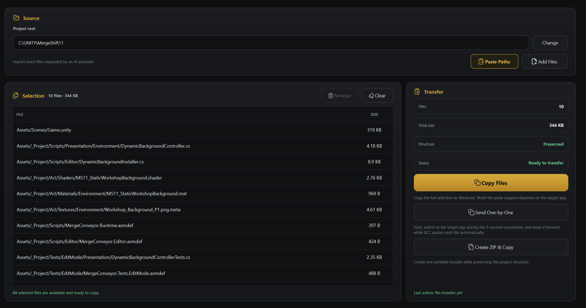

<p align="center">
  
</p>

<h1 align="center">XCC Context Collector</h1>

<p align="center">
  <strong>Передавай AI именно тот контекст проекта — или именно те файлы — которые ему нужны.</strong><br>
  XCC убирает ручную сборку контекста и постоянный поиск файлов в Проводнике.
</p>

<p align="center">
  <a href="README.md">English</a> · <strong>Русский</strong>
</p>

---

## Что делает XCC

XCC — локальное Windows-приложение для двух основных AI-workflow:

| Workflow | Когда использовать | Результат |
|---|---|---|
| **Collect** | AI нужны исходники, Git-состояние или структура проекта | Один структурированный текстовый блок в буфере обмена |
| **Attachments** | AI просит конкретные файлы проекта | Оригинальные файлы, ZIP или последовательная передача |

```text
AI просит контекст                     AI просит файлы
        ↓                                      ↓
      Collect                              Attachments
        ↓                                      ↓
структурированный блок        Copy Files / Send One-by-One / ZIP
        ↓                                      ↓
                продолжение работы с AI
```

Больше не нужно вручную собирать огромные сообщения или искать каждый запрошенный файл по папкам.

<p align="center">
  
</p>

## Скачать

<p align="center">
  <a href="https://github.com/End1essspace/xcc-context-collector/releases"><strong>⬇ Скачать XCC для Windows</strong></a>
  · <a href="docs/PORTABLE_ZIP.md">Portable-инструкция</a>
  · <a href="docs/releases/v1.4.0.md">Описание v1.4.0</a>
</p>

**Текущая версия: v1.4.0**  
**Windows 10/11 x64 · Portable ZIP · Python не требуется**

Файлы релиза:

```text
XCC-Context-Collector-v1.4.0-win64.zip
XCC-Context-Collector-v1.4.0-win64.zip.sha256
```

### Быстрый старт

1. Скачай ZIP из GitHub Releases.
2. Проверь SHA-256.
3. Распакуй целиком папку `XCC Context Collector`.
4. Запусти `XCC Context Collector.exe`.
5. Вставь список путей, который запросил AI, и выбери: собрать контекст или передать оригинальные файлы.

`_internal` и `VERSION.txt` должны оставаться рядом с executable.

---

## Attachments

Используй **Attachments**, когда AI просит сами файлы проекта, а не их текстовое содержимое.

```text
AI просит конкретные файлы
        ↓
Paste Paths / Add Files
        ↓
поиск и проверка путей
        ↓
проверка итогового списка
        ↓
Copy Files / Send One-by-One / Create ZIP & Copy
```

Attachments намеренно отделён от Collect. Этот workflow работает с оригинальными файлами и не применяет ограничения Collect по расширениям.

Поэтому XCC может подготовить к передаче явно выбранный существующий файл независимо от его типа: исходник, изображение, Unity asset, архив, binary, database или другой артефакт проекта.

<p align="center">
  
</p>

### Copy Files

Помещает выбранные файлы в Windows clipboard как файловые объекты.

Используй этот вариант, если целевое приложение умеет принимать файлы через обычную вставку.

### Send One-by-One

Автоматизирует последовательную передачу для приложений, которые принимают только один файл за одну вставку.

XCC:

- запускает короткий countdown;
- фиксирует одно целевое foreground-окно;
- подготавливает по одному выбранному файлу;
- проверяет, что фокус не изменился;
- отправляет один `Ctrl+V` на файл;
- останавливается при смене целевого окна;
- не нажимает Enter и не отправляет сообщение.

Это автоматизация обычного Windows input, а не управление DOM браузера и не интеграция с API AI-сервиса.

### Create ZIP & Copy

Создаёт один ZIP64-совместимый архив и копирует готовый ZIP как один файловый объект.

Архив:

- сохраняет безопасную относительную структуру проекта, когда это возможно;
- сохраняет оригинальные байты файлов;
- отклоняет небезопасные пути;
- публикуется только после успешного завершения;
- хранится в `%USERPROFILE%\.xcc\attachment-bundles\`.

Для больших наборов файлов или приложений с ограниченной поддержкой clipboard это самый предсказуемый вариант.

> **Примечание о браузерах:** XCC гарантирует локальную подготовку файлов. То, как принимающее приложение обрабатывает вставку, контролирует уже оно. Если важно сохранить имена и структуру каталогов, используй **Create ZIP & Copy**.

---

## Collect

Используй **Collect**, когда AI нужен читаемый контекст проекта, а не сами файловые объекты.

### Режимы

| Режим | Когда использовать | Результат |
|---|---|---|
| **Selected Files** | Точный запрос AI или локальная отладка | Упорядоченный набор выбранных файлов |
| **Full Folder** | Нужен широкий контекст проекта | Поддерживаемые файлы, ignore rules и project tree |
| **Git Changed Files** | Нужно разобрать текущие изменения | Изменённые файлы и отдельные staged / unstaged Git diff |
| **Project Tree** | Нужна архитектура без содержимого файлов | Только структура репозитория |

### AI → XCC → AI

Если ассистент уже перечислил нужные файлы:

```text
AI возвращает список путей
        ↓
Paste Paths / Ctrl+V
        ↓
XCC находит их внутри project root
        ↓
проверка итогового списка
        ↓
Collect & Copy
        ↓
структурированный контекст обратно в AI
```

**Paste Paths** понимает обычные строки, Markdown-списки, кавычки, backticks и fenced code blocks.

Относительный выход за пределы выбранного project root отклоняется. Итоговый набор можно проверить до запуска Collect.

### Точность контекста

XCC относится к исходникам как к данным, которые нельзя незаметно «улучшать».

- содержимое файлов и Git diff не переписывается и не нормализуется;
- Compact mode меняет только структуру, которую создаёт сам XCC;
- файлы и diff не обрываются молча посередине;
- warnings, omissions, errors, summaries и truncation отображаются явно;
- отмена не публикует частичный результат.

Готовый контекст может включать version metadata, статистику, safety warnings, Git status и diff, project tree, полные секции файлов, errors и явный budget summary.

---

## Главное в v1.4.0

v1.4.0 превращает XCC из context collector в полноценный инструмент для передачи контекста и файлов между локальным проектом и AI.

- **Attachments workspace** для оригинальных файлов.
- **Copy Files** для прямой передачи Windows file objects через clipboard.
- **Send One-by-One** для контролируемой последовательной вставки.
- **Create ZIP & Copy** с безопасными относительными путями и ZIP64.
- **Настраиваемые global hotkeys** для Restore / Show, Collect & Copy и optional Attachment Handoff.
- **Persistent и exportable Runtime History** без хранения содержимого проекта.
- Общая responsive-геометрия для Attachments, Settings, History и About.
- Усиленная release-проверка, DPI reliability, безопасный traversal и packaging.

---

## Local-first

XCC работает с исходным кодом и файлами проекта, поэтому приватность является частью архитектуры продукта.

- **Аккаунт не нужен.**
- **Нет telemetry.**
- **XCC сам ничего не загружает в облако.**
- Сбор и форматирование происходят локально.
- Публикация в clipboard всегда является явным действием пользователя.
- Оригинальные attachments не переписываются, не перемещаются и не удаляются.
- Safety detection предупреждает, а не молча изменяет или скрывает содержимое.
- Runtime History хранит metadata, а не содержимое проекта.

Runtime History:

```text
%USERPROFILE%\.xcc\history.json
```

В нём не сохраняются исходники, тела Git diff, найденные secret values, содержимое attachments и raw failure bodies.

---

## Runtime History

<p align="center">
  
</p>

History сохраняет между запусками operational outcomes: duration, sanitized source metadata, coverage, truncation, warnings, errors и attachment-transfer metadata.

Хранятся максимум **200 записей**. Доступен экспорт в документированный JSON format. History остаётся metadata-only.

---

## Windows integration

- Windows 10/11 x64;
- PySide6 desktop UI;
- portable ZIP distribution;
- tray и close-to-tray;
- `Esc` hide-to-tray;
- настраиваемые native global hotkeys;
- single-instance restore;
- optional Start with Windows;
- persistent local settings.

Настройки:

```text
%USERPROFILE%\.xcc\config.json
```

---

## Установка

Подробности по SHA-256, распаковке, обновлению и удалению: [Portable ZIP Usage](docs/PORTABLE_ZIP.md).

Python для packaged build не нужен.

---

## Запуск из исходников

Поддерживаемая development-среда: **CPython 3.13.x** на Windows 10/11 x64.

```powershell
py -3.13 -m venv .venv
.\.venv\Scripts\Activate.ps1
python -m pip install --upgrade pip
python -m pip install -e ".[dev]"
python -m compileall -q src tests scripts gui.py
python scripts\check_version_consistency.py
python -m pytest -q
python gui.py
```

Installed entry point:

```text
xcc-context-collector
```

---

## Документация

| Документ | Назначение |
|---|---|
| [Архитектура](docs/ARCHITECTURE.md) | Runtime, UI, responsive, DPI и release boundaries |
| [UI-контракт v1.4.0](docs/UI_REFERENCE_v1.4.0.md) | Зафиксированный visual и interaction contract |
| [Validation v1.4.0](docs/M17_VALIDATION.md) | Release-candidate и clean-host procedure |
| [Release checklist](docs/RELEASE_CHECKLIST.md) | Компактный operational release gate |
| [Portable ZIP](docs/PORTABLE_ZIP.md) | Checksum, extraction, updates и removal |
| [Диагностика bug reports](docs/BUG_REPORTING.md) | Воспроизводимые sanitized reports |
| [Release notes v1.4.0](docs/releases/v1.4.0.md) | User-visible release summary |
| [Roadmap](docs/XCC_ROADMAP_v1.4.0_UPDATED.md) | Статус релиза и следующие шаги |
| [Contributing](CONTRIBUTING.md) | Правила разработки |
| [Security](SECURITY.md) | Security model и reporting |

---

## Автор

**End1essspace | RX**  
Telegram: [@End1essspace](https://t.me/End1essspace)  
GitHub: [End1essspace](https://github.com/End1essspace)

## Лицензия

XCC Context Collector распространяется по лицензии [GNU GPL v3.0](LICENSE).

Copyright (C) 2026 Rafael Xudoynazarov (End1essspace | RX)
